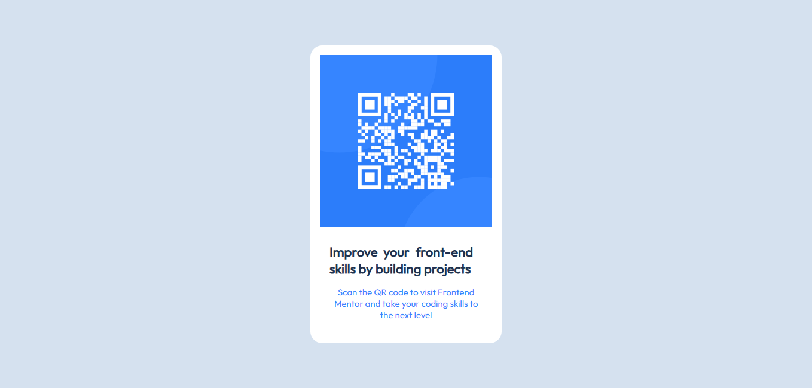

# Frontend Mentor - QR code component solution

This is a solution to the [QR code component challenge on Frontend Mentor](https://www.frontendmentor.io/challenges/qr-code-component-iux_sIO_H). Frontend Mentor challenges help you improve your coding skills by building realistic projects. 

## Table of contents

  - [Overview](#overview)
  - [Screenshot](#screenshot)
  - [Links](#links)
  - [Built with](#built-with)
  - [What I learned](#what-i-learned)
  - [Author](#author)
  - [Acknowledgments](#acknowledgments)

## Overview

### The Challenge
- View the QR code component centered on the page.

### Screenshot

### Links

- Solution URL: [GitHub Repo](https://github.com/Chantal-Yvonne/qr-code-component)
- Live Site URL: [Add live site URL here](https://your-live-site-url.com)

### Built with

- Semantic HTML5 markup
- CSS custom properties
- Flexbox

### What I learned
-How to follow  design system(colors, fonts,spacing) using  style guide.
-How to center element vertically nd horizontally uing flexbox.
-How to deploy  project uing Github Pages.

## Author

- Frontend Mentor - [@Chantal-Yvonne](https://www.frontendmentor.io/profile/Chantal-Yvonne)

## Acknowledgments

This project was built based on a design brief provided by [Frontend Mentor](https://www.frontendmentor.io/).
Thanks to the Frontend Mentor community for creating helpful challenges that support practical learning and real-world development skills

